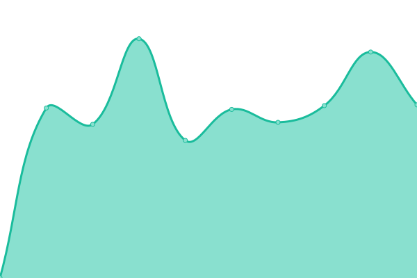
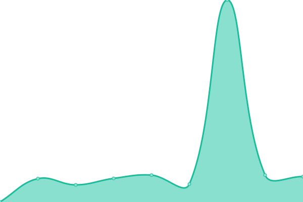
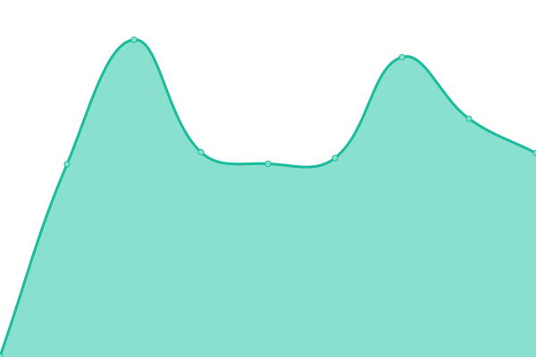

# [📈 Live Status](https://status.beeshosting.eu.org): <!--live status--> **🟧 Partial outage**

This repository contains the open-source uptime monitor and status page for [Bees Hosting](www.beeshosting.fr), powered by [Upptime](https://github.com/upptime/upptime).

With [Upptime](https://upptime.js.org), you can get your own unlimited and free uptime monitor and status page, powered entirely by a GitHub repository. We use [Issues](https://github.com/Bees-Hosting/statuspage/issues) as incident reports, [Actions](https://github.com/Bees-Hosting/statuspage/actions) as uptime monitors, and [Pages](https://status.beeshosting.eu.org) for the status page.

<!--start: status pages-->
<!-- This summary is generated by Upptime (https://github.com/upptime/upptime) -->
<!-- Do not edit this manually, your changes will be overwritten -->
<!-- prettier-ignore -->
| URL | Status | History | Response Time | Uptime |
| --- | ------ | ------- | ------------- | ------ |
|  [Espace client](https://my.beeshosting.eu.org) | 🟩 Up | [espace-client.yml](https://github.com/Bees-Hosting/statuspage/commits/HEAD/history/espace-client.yml) | 

 6768ms
     
 | 

<a href="https://status.beeshosting.eu.org/history/espace-client">28.62%</a>
    

|  [CPanel](https://cpanel.beeshosting.eu.org) | 🟩 Up | [c-panel.yml](https://github.com/Bees-Hosting/statuspage/commits/HEAD/history/c-panel.yml) | 

 745ms
     
 | 

<a href="https://status.beeshosting.eu.org/history/c-panel">100.00%</a>
    

|  [Serveur FTP](ftpupload.net) | 🟥 Down | [serveur-ftp.yml](https://github.com/Bees-Hosting/statuspage/commits/HEAD/history/serveur-ftp.yml) | 

 238ms
     
 | 

<a href="https://status.beeshosting.eu.org/history/serveur-ftp">98.40%</a>
    

|  [Nameserver 1](ns1.bs.cluster.ws) | 🟩 Up | [nameserver-1.yml](https://github.com/Bees-Hosting/statuspage/commits/HEAD/history/nameserver-1.yml) | 

 266ms
     
 | 

<a href="https://status.beeshosting.eu.org/history/nameserver-1">100.00%</a>
    

|  [Nameserver 2](ns2.bs.cluster.ws) | 🟩 Up | [nameserver-2.yml](https://github.com/Bees-Hosting/statuspage/commits/HEAD/history/nameserver-2.yml) | 

 176ms
     
 | 

<a href="https://status.beeshosting.eu.org/history/nameserver-2">100.00%</a>
    

|  [Gestionnaire de fichiers en ligne](https://filemanager.ai/new/) | 🟥 Down | [gestionnaire-de-fichiers-en-ligne.yml](https://github.com/Bees-Hosting/statuspage/commits/HEAD/history/gestionnaire-de-fichiers-en-ligne.yml) | 

 392ms
     
 | 

<a href="https://status.beeshosting.eu.org/history/gestionnaire-de-fichiers-en-ligne">98.11%</a>
    

|  [phpMyAdmin](185.27.134.10) | 🟩 Up | [php-my-admin.yml](https://github.com/Bees-Hosting/statuspage/commits/HEAD/history/php-my-admin.yml) | 

 115ms
     
 | 

<a href="https://status.beeshosting.eu.org/history/php-my-admin">100.00%</a>
    

|  [Softaculous](sv1.scriptinstall.rocks) | 🟩 Up | [softaculous.yml](https://github.com/Bees-Hosting/statuspage/commits/HEAD/history/softaculous.yml) | 

 505ms
     
 | 

<a href="https://status.beeshosting.eu.org/history/softaculous">100.00%</a>
    

|  [Site vitrine](https://beeshosting.eu.org/) | 🟩 Up | [site-vitrine.yml](https://github.com/Bees-Hosting/statuspage/commits/HEAD/history/site-vitrine.yml) | 

 638ms
     
 | 

<a href="https://status.beeshosting.eu.org/history/site-vitrine">100.00%</a>
    

|  [API MyOwnFreeHost](https://panel.myownfreehost.net/xml-api/) | 🟩 Up | [api-my-own-free-host.yml](https://github.com/Bees-Hosting/statuspage/commits/HEAD/history/api-my-own-free-host.yml) | 

 792ms
     
 | 

<a href="https://status.beeshosting.eu.org/history/api-my-own-free-host">100.00%</a>
    

|  [API GoGetSSL](https://my.gogetssl.com/api/) | 🟩 Up | [api-go-get-ssl.yml](https://github.com/Bees-Hosting/statuspage/commits/HEAD/history/api-go-get-ssl.yml) | 

 531ms
     
 | 

<a href="https://status.beeshosting.eu.org/history/api-go-get-ssl">100.00%</a>
    

<!--end: status pages-->

[**Visit our status website →**](https://status.beeshosting.eu.org)

## 📄 License

- Powered by: [Upptime](https://github.com/upptime/upptime)
- Code: [MIT](./LICENSE) © [Bees Hosting](www.beeshosting.fr)
- Data in the `./history` directory: [Open Database License](https://opendatacommons.org/licenses/odbl/1-0/)
